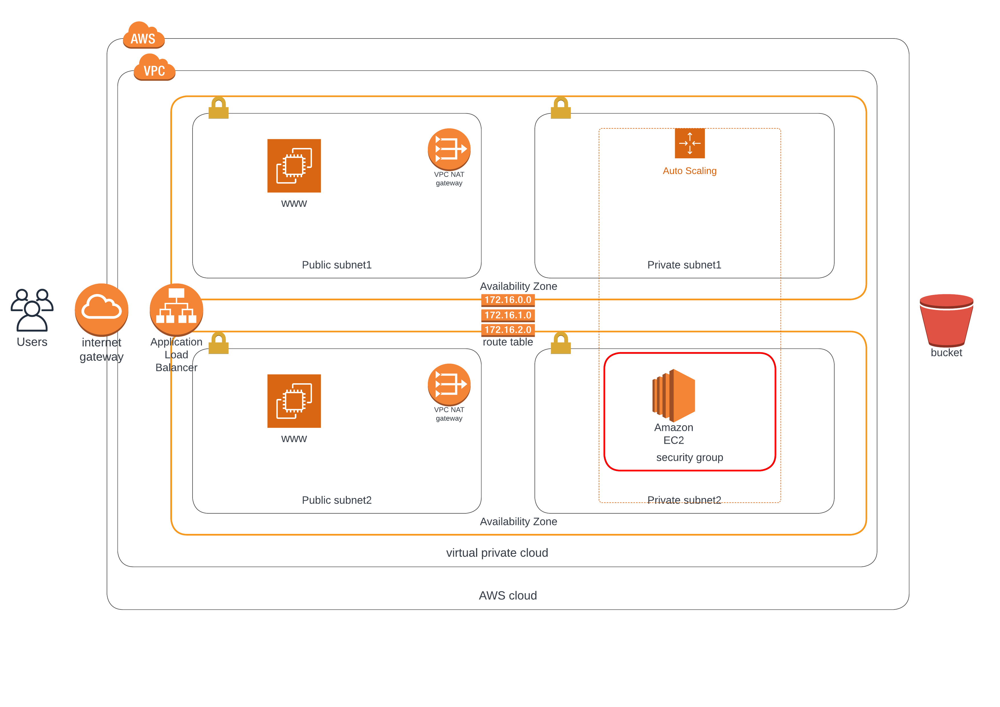

# Infrastructure Diagram

You can access the website at [demo-webapp](http://serve-webap-4yk6643aaowh-1137078415.us-east-1.elb.amazonaws.com/).

## Procedure Details
1. Run the CloudFormation script to create the infrastructure: `./create-all.sh`
2. To update the infrastructure, run the CloudFormation script: `./update-all.sh`
3. To delete the infrastructure, run the CloudFormation script: `./delete-all.sh` 

## Requirements & Details
### Details
1. Deploy a dummy application (a sample JavaScript or HTML file) to the Apache Web Server running on an EC2 instance.
2. Deploy sample website files located in a public S3 Bucket to the Apache Web Server running on an EC2 instance.

### Server specs
1. Create a Launch Configuration for the application servers in order to deploy four servers, two located in each of our private subnets. The launch configuration will be used by an auto-scaling group.
2. Use **two vCPUs** and at least **4GB of RAM**. The Operating System to be used is Ubuntu 18.
3. Allocate at least **10GB of disk space**. 

### Security Groups and Roles
1. Since we will be downloading the application archive from an S3 Bucket, we'll need to create an `IAM Role` that allows our instances to use the S3 Service.
2. The dummy app communicates on the default `HTTP Port: 80`, so our servers will need this inbound port open since we will use it with the Load Balancer and the Load Balancer Health Check. As for outbound, the servers will need unrestricted internet access to be able to download and update their software.
3. The load balancer should allow all public traffic `(0.0.0.0/0)` on `port 80` inbound, which is the default HTTP port. Outbound, it will only be using port 80 to reach the internal servers.
4. The application needs to be deployed into private subnets with a Load Balancer located in a public subnet.
5. One of the output exports of the CloudFormation script should be the public URL of the LoadBalancer. 
6. Add `http://` in front of the load balancer DNS Name in the output, for convenience.

### Other Considerations
1. We can deploy our servers with an SSH Key into Public subnets while we are creating the script. This helps with troubleshooting. Once done, we will move them to our private subnets and remove the SSH Key from our Launch Configuration.
2. It also helps to test directly, without the load balancer. Once we are confident that our server is behaving correctly, increase the instance count and add the load balancer to our script.
3. While our instances are in public subnets, we'll also need the SSH port open (port 22) for our access, in case we need to troubleshoot our instances.
4. Log information for UserData scripts is located in this file: `cloud-init-output.log` under the folder: `/var/log`.
5. we should be able to destroy the entire infrastructure and build it back up without any manual steps required, other than running the CloudFormation script.
6. The provided UserData script should help we install all the required dependencies. Bear in mind that this process takes several minutes to complete. Also, the application takes a few seconds to load. This information is crucial for the settings of our load balancer health check.
7. It's up to we to decide which values should be parameters and which we will hard-code in our script.
8. If we want to go the extra mile, we can set up a bastion host (jump box) to allow us to SSH into our private subnet servers. This bastion host would be on a Public Subnet with port 22 open only to our home IP address, and it would need to have the private key that we use to access the other servers.

>> Remember to delete our CloudFormation stack when we're done to avoid recurring charges!